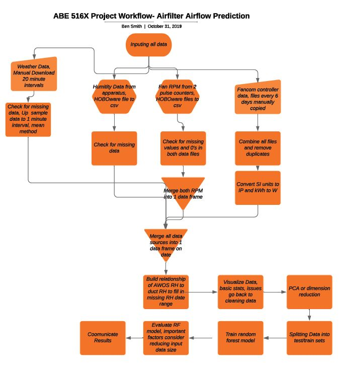
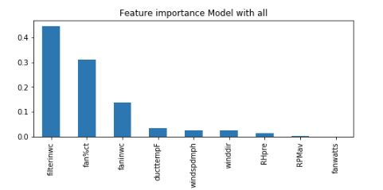
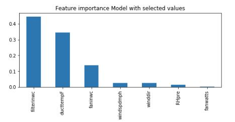

## ABE 516X Project by Ben Smtih

### Introduction

The purpose of this project is to develop a machine learning model for predicting the air flow through an air filter wall bank. This project is based on the use of air filters in animal agriculture building ventilation systems. These systems employ large numbers of pre-filters and v-bank filters (primary and secondary filters) making testing filters very expensive. The primary objective of this project is to model the airflow using the ventilation system parameters. The ultimate goal for this project is to develop a system to monitor and predict when the filters are loaded and need replaced in-situ to save producers money on filter testing. 

Pre-filters installed 
Photo by Ben Smith

 V-bank type filter 
Photo by Ben Smith

Photo by Ben Smith

### Data Aquisition
Data for this prject was generated from an Environmental Air Filter Testing Chamber that houses 4 pairs of pre-filters and v-bank filters in series. The chamber utilizes a low pressure, high volume 24 inch diameter axial fan with a measuring device to pull air through the chamber. The controller's logic varies the airflow rate through the chamber based on the temperature inside the chamber. The controller records data values at a 1 minute interval from including the chamber temperature, fan control percentage, actual fan airflow percentage, fan kWh register, fan static pressure, and air filter bank static pressure. A new data file was generated every 6 days from the controller.

 
Photo by Ben Smith

The RPM of the fan was logged using a contactless laser tachometer and 2 Onset HOBO pulse counters for redundancy at a recording rate of 1 minute. Relative humidity ouside the chamber, prior to the filter bank, and post filter bank were logged at 1 minute intervals using Dwyer RH sensors and a Onset HOBO Analog data logger. The weather data was gathered from the MESONET from the Boone Municipal Airport at 20 minute intervals.

### Project Work Flow

See the picture below for the inital expected work flow for the project.

 
Photo by Ben Smith

# Code for Sections moving forward
[Preprocessing Notebook](https://nbviewer.jupyter.org/github/bcsmith1/516x-Project-Code/blob/master/ABE516x%20Project%20Data%20Preprocessing.ipynb)
[Processing Controller Data Notebook](https://nbviewer.jupyter.org/github/bcsmith1/516x-Project-Code/blob/master/Controller%20data%20processing%20and%20cleaning.ipynb)
[Final Merger, data visualization, and modeling Notebook](https://nbviewer.jupyter.org/github/bcsmith1/516x-Project-Code/blob/master/Combining%20code%20data%20vis%20and%20modeling.ipynb)

#### Data Wrangling Tasks
The largest data wrangling task was taking in the 4 different sources of data, cleaning and preparing each source independently and merging them into 1 complete data frame. The controller data involved reading in multiple csv files and concating them. Other tasks from the other sources included up sampling data and filling in missing data values.

### Data Exploration

The first task for data visualization was fill in the missing day of relative humidity (RH) data. Pariwise plots were created showing the relationship between the weather station data and the 3 RH sensors on the chamber. Based on the visulaization and then a Pearson Correlation test indicated that the 3 RH sensors on the chamber followed the weather station reading well. The ambient RH sensor on the chamber appeared to have issues at low values and the pre and post filter bank sensors had identical readings, the correlation value between the two was one. Based on that the ambient and post filter bank sensors were ignored moving forward. A linear regression between the pre filter bank and weather station value was modeled and used to fill in the missing data from when no RH sensors were installed on the chamber.

## Modeling Methods
For this project a Random Forest Model was utilized. In previous class exercise a linear regression model was attempted, but resulted in a high error value. This model lacked inputs of wind speed and direction as well as RH and fan RPM. Two random forest models were trained and evaluated on the accuracy of predicting the airflow through the chamber. The first model included all parameters gathered in the data base including: fan control percentage, chamber temperature, filter static pressure, fan static pressure, fan wattage, pre filter bank RH, fan RPM, wind speed, and wind direction. The second model had fewer inputs, these inputs were selected based on the difficulty to collect these values in-situ and were fan control percentage and fan RPM.

The models were evaluated using R^2 values, and the RMSE of the model. The most critical inputs were also compared for each model. Note the RMSE was modified to be on a per filter basis for the chamber by dividing the RMSE for the model by four. This made for easier comparison of the model results to commercial filter testing variance. For refernce a mobile air filter testing lab had a maximum uncertainty of 10 cfm at an airflow rate of 202 cfm [1](https://cigrjournal.org/index.php/Ejounral/article/view/5458)

### Modeling Results 
 Quick Review: The main goal of this project is to develop a model to predict the airflow through an Environmental Air Filter Testing Chamber. The ultimate goal is to build this model into a prediction model to tell a swine or poultry producer when their air filters are loaded and need replaced without actually testing the air filters themselves.
 
 For both Models the R^2 value was approximately 0.98 with a RMSE of 16 cfm per filter. The reduction on inputs had a small increase on the error of the model. For training time the full model took almost twice as long to train as the second model. The interesting result is that the Fan RPM and wattage was not a major factor of importance and when the fan control percentage was removed the chamber temperature took its place as a factor of importance. This is reasonable as the control percentage is decided based on the chamber temperature.

 
 
  

### Class Exercise

The class exercise I would do using my project data would be a data wrangling task. I did debate a random forest task, but because of the large size of the data frame to begin with, 300,000 lines, the time invovled with just training the model alone would not be practical.

This class exercise would be a portion of the tasks of the data wrangling in my project involved with reading in multiple csv files and combining them, then sorting them by date and time stamp, and lastly merging in an additional csv file and using a custom fill missing value function. This would expose students to the encoding parameter of the pd.read_csv function, concating data frames together, as well as sorting the data. The last part of the task I would suggest including would be merging in the RH data file and then creating a custom fillnan function. I would suggest that the linear regression be given so that the task stays managable in length. See a suggested version of the notebook here:

### References
1.	Smith, B. C., Ramirez, B. C., Hoff, S. J., Harmon, J. D., Stinn, J. P. (2019) Design and validation of a mobile air filter testing laboratory for animal agriculture applications. Agricultural Engineering International: CIGR Journal, 21(3): 39-5.
