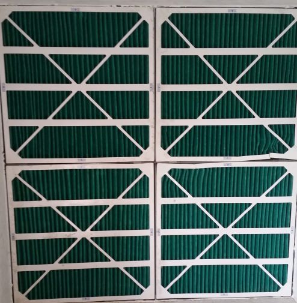
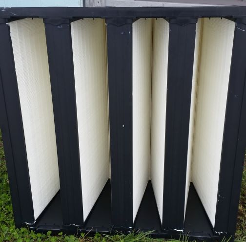
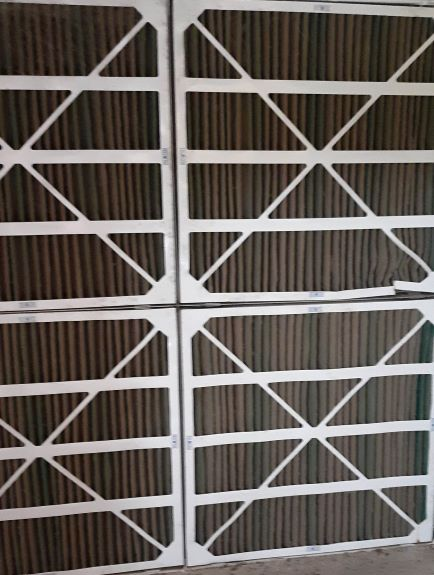
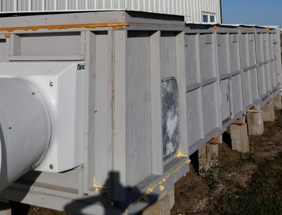

## ABE 516X Project by Ben Smtih

### Introduction

The purpose of this project is to develop a machine learning model for predicting the air flow through an air filter wall bank. This project is based on the use of air filters in animal agriculture building ventilation systems. These systems employ large numbers of pre-filters and v-bank filters (primary and secondary filters) making testing filters very expensive. The primary objective of this project is to model the airflow using the ventilation system parameters. The ultimate goal for this project is to develop a system to monitor and predict when the filters are loaded and need replaced in-situ to save producers money on filter testing. 

Pre-filters installed 
Photo by Ben Smith

 V-bank type filter 
Photo by Ben Smith

Photo by Ben Smith

### Data Aquisition
Data for this prject was generated from an Environmental Air Filter Testing Chamber that houses 4 pairs of pre-filters and v-bank filters in series. The chamber utilizes a low pressure, high volume 24 inch diameter axial fan with a measuring device to pull air through the chamber. The controller's logic varies the airflow rate through the chamber based on the temperature inside the chamber. The controller records data values at a 1 minute interval from including the chamber temperature, fan control percentage, actual fan airflow percentage, fan kWh register, fan static pressure, and air filter bank static pressure. A new data file was generated every 6 days from the controller.

 
Photo by Ben Smith

The RPM of the fan was logged using a contactless laser tachometer and 2 Onset HOBO pulse counters for redundancy at a recording rate of 1 minute. Relative humidity ouside the chamber, prior to the filter bank, and post filter bank were logged at 1 minute intervals using Dwyer RH sensors and a Onset HOBO Analog data logger. The weather data was gathered from the MESONET from the Boone Municipal Airport at 20 minute intervals.

### Project Work Flow

See the picture below for the inital expected work flow for the project.

 
Photo by Ben Smith

#### Data Wrangling Tasks
The largest data wrangling task was taking in the 4 different sources of data, cleaning and preparing each source independently and merging them into 1 complete data frame. The controller data involved reading in multiple csv files and concating them. Other tasks from the other sources included up sampling data and filling in missing data values.

### Data Exploration

You can use a website to host notebooks.  First, you'll want to get the "raw" url from Github where your notebook is stored.  Then, navigate to https://nbviewer.jupyter.org and paste that URL.  The result will be a new generated URL that hosts your notebook.  This can be a [link](https://nbviewer.jupyter.org/github/isu-abe/516x/blob/master/module2/bootcamp/notebooks/nocode/Module%20IIB%20-%20Python%20Basics%20-%20no%20code.ipynb) in your website.

## Modeling Methods

### Modeling Results 

What is the scientitifc goal?  What would you do if you had all the data?  What do you want to predict or estimate?  Why is this relevant to ABE researchers or the field?  Provide some background on the rationale and relevance.

### Results and Discussion

### Class Exercise

In each project, I'd like to see a homework assignment that the class can do/evaluate to learn more about your data.  This should be a reproducible notebook that allows them to learn one or more aspects of your data workflow.  It is also an opportunity to share your research with your colleagues.

Here is an example of a fantastic project website:

https://stephenslab.github.io/ipynb-website/

